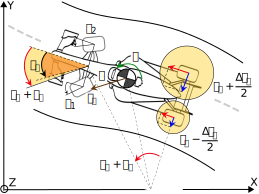

# Implementation of Fuzzy-based Yaw Stability Control System with Torque Vectoring and Active Steering (MERCon 2024)
This repository contains the implementation codes for our paper titled "Fuzzy-based Yaw Stability Control System with Torque Vectoring and Active Steering", accepted at Moratuwa Engineering Research Conference, 2024.

## Table of Contents

- [Introduction](#introduction)
- [Repository Structure](#repository-structure)
- [Installation](#installation)
- [Usage](#usage)
- [Examples](#examples)
- [Citation](#citation)
- [Contributing](#contributing)
- [License](#license)
- [Acknowledgements](#acknowledgements)

## Introduction

This repository provides the source code and datasets used in our paper, "Fuzzy-based Yaw Stability Control System with Torque Vectoring and Active Steering". For more details, please refer to the full paper available [here](link_to_paper).



[//]: # (### Abstract)

>Yaw stability control is essential for the safe operation of a vehicle. This paper presents a robust fuzzy-based integration of active steering with torque vectoring in order to achieve vehicle yaw stability. A single-track vehicle model is used to mathematically model the vehicle, accommodating the active front steering and torque vectoring systems. A fuzzy logic controller is employed to calculate the required corrective steering and differential torque based on the error in yaw rate. The implementation of this system is carried out using MATLAB, using the parameters of a compact SUV. Furthermore, an analysis of the effect of the proportion of corrective assistance given by active front steering and torque vectoring is done. The results indicate enhanced vehicle manoeuvrability during cornering, as evidenced by the near alignment of the measured yaw rate with the desired values. The simulations are carried out for two speeds, and in both cases, the effect of the controller is significant, with the normalised root mean square error reducing from 10\% to 3.94\% and from 12.9\% to 4.01\% for 60 \unit{km/h} and 100 \unit{km/h} respectively. The results also show that corrective active steering has a greater effect on yaw stability than an equivalent amount of corrective torque vectoring.

## Repository Structure

```bash
├── data/                   # Directory containing datasets
│   ├── raw/                # Raw data
│   └── processed/          # Processed data
├── src/                    # Source code
│   ├── modules/            # Code modules
│   ├── scripts/            # Scripts to run experiments
│   └── notebooks/          # Jupyter notebooks for analysis
├── results/                # Directory for storing results
├── tests/                  # Unit tests
├── README.md               # This README file
└── requirements.txt        # Python dependencies
```

## Installation

To run the code in this repository, you'll need to have [MATLAB 202X](https://www.python.org/downloads/) installed.

## Usage

The main scripts to run our experiments can be found in the `src/scripts/` directory. Below are examples of how to run these scripts:

```sh
python src/scripts/run_experiment.py --config configs/experiment1.yaml
```

For a detailed explanation of the command-line arguments and options, please refer to the documentation within each script.

## Examples

We have provided example Jupyter notebooks in the `src/notebooks/` directory to demonstrate how to use our code. You can start with the `example_notebook.ipynb` to get an overview of the basic functionalities.

## Citation

If you find this code useful in your research, please cite our paper:

```bibtex
@inproceedings{your_paper,
  title={Paper Title},
  author={Author1, Firstname1 and Author2, Firstname2 and Author3, Firstname3},
  booktitle={Proceedings of the Conference Name},
  year={Year}
}
```

## Contributing

We welcome contributions from the community. If you'd like to contribute, please follow these steps:

1. Fork this repository
2. Create a new branch (`git checkout -b feature-branch`)
3. Make your changes
4. Commit your changes (`git commit -am 'Add new feature'`)
5. Push to the branch (`git push origin feature-branch`)
6. Create a new Pull Request

## License

This project is licensed under the MIT License - see the [LICENSE](LICENSE) file for details.

## Acknowledgements

We would like to thank Falcon E Racing, the electric formula student team of the University of Moratuwa for their support. 
"""

with open("README.md", "w") as f:
    f.write(readme_content)

print("README.md file has been generated successfully.")
